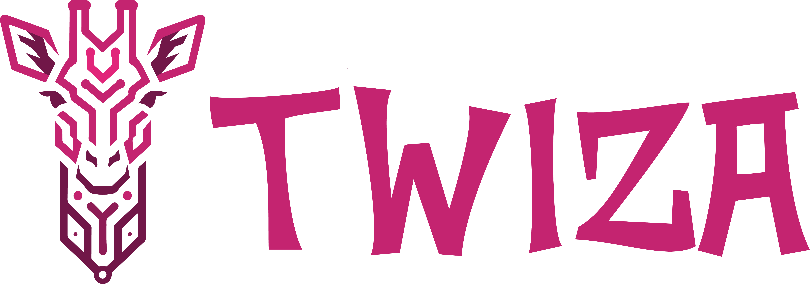

<p align="center">
  
</p>

<h3 align="center">...more than an agent!</h3>

<p align="center">
  Your Personal AI Agent for Windows<br>
  One-click installer • Multi-channel chat • Local models • Privacy-first
</p>

<p align="center">
  <a href="https://github.com/AvatarNemo/twiza-moneypenny/releases"></a>
  <a href="LICENSE"></a>
  <a href="https://github.com/AvatarNemo/twiza-moneypenny/stargazers"></a>
</p>

---

## ✨ What is TWIZA Moneypenny?

TWIZA Moneypenny is a **Windows desktop app** that gives you a fully-featured personal AI assistant — running on your machine, connected to your services, with a personality you define.

No cloud dependencies required. Your data stays yours.

<!-- 
## 📸 Screenshots


-->

## 🚀 Features

- 🧠 **Smart Agent** — Powered by Claude, GPT-4, Gemini, or local models via Ollama
- 💬 **Multi-Channel** — Chat via WhatsApp, Telegram, Discord, or the built-in webchat
- 🎭 **Custom Personality** — Define your agent's voice with SOUL.md templates
- 🧩 **29 Integrations** — GitHub, Email, Voice, Mastodon, Twitter, TikTok, LinkedIn, Spotify, and more
- 🔒 **Privacy-First** — Everything runs locally inside WSL2. API keys never leave your machine
- 📝 **Persistent Memory** — Your agent remembers context across sessions
- 🤖 **Local Models** — Run Ollama for fully offline, private conversations
- 🎨 **Beautiful UI** — TWIZA-branded dark theme with setup wizard
- 🔄 **Auto-Updates** — Get notified when new versions are available
- 💾 **Backup & Restore** — Scheduled backups of your agent's workspace
- 🩺 **Built-in Diagnostics** — Self-heal, log viewer, system checks

## ⚡ Quick Start

### 1. Download

Grab the latest installer from [**Releases**](https://github.com/AvatarNemo/twiza-moneypenny/releases).

### 2. Install & Setup

Run `TWIZA Moneypenny_x.x.x_x64-setup.exe` and follow the wizard:

1. Choose your AI provider (Anthropic, OpenAI, Google, etc.)
2. Name your agent and pick a personality
3. Connect channels (WhatsApp, Telegram, Discord — all optional)
4. Optionally download a local model
5. Done! Your agent is live 🟢

### 3. Chat

- **System tray** → double-click to open webchat
- **Browser** → `http://localhost:18789`
- **WhatsApp/Telegram/Discord** → message your agent directly

## 📋 System Requirements

| Component | Minimum | Recommended |
|-----------|---------|-------------|
| **OS** | Windows 10 v2004+ | Windows 11 |
| **RAM** | 8 GB | 16 GB |
| **Disk** | 10 GB | 30 GB (with local models) |
| **CPU** | x64 with virtualization | Modern multi-core |
| **GPU** | — | NVIDIA (for local models) |

## 🏗️ Architecture

TWIZA Moneypenny is built on **Tauri 2.x** with a Rust backend, replacing the original Electron prototype.

```
┌──────────────────────────────────────────┐
│          TWIZA Moneypenny (Windows)             │
│  ┌────────────────┐ ┌─────────────────┐  │
│  │  Tauri Shell   │ │  Webview UI     │  │
│  │  (Rust)        │ │  (HTML/JS)      │  │
│  │                │ │  Wizard,        │  │
│  │  37 IPC cmds   │ │  Settings,      │  │
│  │  OAuth2 flows  │ │  Models mgmt    │  │
│  │  GPU detection │ │                 │  │
│  └───────┬────────┘ └────────┬────────┘  │
│          │                    │           │
│          ▼                    ▼           │
│  ┌──────────────────────────────────────┐│
│  │          WSL2 Backend               ││
│  │  ┌──────────────┐ ┌──────────────┐  ││
│  │  │  OpenClaw    │ │   Ollama     │  ││
│  │  │  Gateway     │ │  (optional)  │  ││
│  │  └──────────────┘ └──────────────┘  ││
│  └──────────────────────────────────────┘│
└──────────────────────────────────────────┘
```

**Tauri (Rust)** handles the Windows shell, system tray, IPC commands, native notifications, and OAuth2 flows. The frontend is plain HTML/JS served via Tauri's webview. **OpenClaw** runs inside WSL2 as the AI gateway — managing models, channels, memory, and tools. **Ollama** provides optional local model inference.

### Rust Backend Modules

| Module | Purpose |
|--------|---------|
| `main.rs` | App lifecycle, 37 IPC commands, window management |
| `gateway.rs` | WSL2 gateway process management |
| `oauth.rs` | OAuth2 authorization flows |
| `state.rs` | Application state management |
| `wsl.rs` | WSL2 command execution helpers |

## 📖 Documentation

- [**User Guide**](docs/USER-GUIDE.md) — Full walkthrough, integration setup, troubleshooting
- [**Contributing**](docs/CONTRIBUTING.md) — Development setup, architecture, PR process
- [**Roadmap**](ROADMAP.md) — Development phases and planned features
- [**Integrations**](INTEGRATIONS.md) — Full catalog of 70+ integrations (34 active modules)
- [**Style Guide**](STYLE-GUIDE.md) — TWIZA branding and UI guidelines

## 🛠️ Development

```bash
# Clone
git clone https://github.com/AvatarNemo/twiza-moneypenny.git
cd twiza-moneypenny

# Install frontend dependencies
npm install

# Run in dev mode (requires Rust toolchain + Tauri CLI)
cargo tauri dev

# Build Windows installer
cargo tauri build
```

### Project Structure

```
twiza-moneypenny/
├── src-tauri/
│   ├── src/
│   │   ├── main.rs            # Tauri app + 37 IPC commands
│   │   ├── gateway.rs         # WSL2 gateway management
│   │   ├── oauth.rs           # OAuth2 flows
│   │   ├── state.rs           # App state
│   │   └── wsl.rs             # WSL2 helpers
│   ├── Cargo.toml             # Rust dependencies
│   └── tauri.conf.json        # Tauri configuration
├── src/
│   ├── tauri-bridge.js        # Tauri IPC bridge (replaces Electron preload)
│   ├── config-generator.js    # Wizard → OpenClaw config
│   ├── wizard/                # Setup wizard UI
│   ├── settings/              # Settings panel UI
│   ├── onboarding/            # First-run experience
│   ├── templates/             # Personality gallery
│   ├── models/                # Ollama manager
│   └── integrations/          # 33 integration modules
├── assets/branding/           # Logos, icons
├── workspace-template/        # Default workspace files
├── scripts/                   # Bootstrap & install scripts
├── docs/                      # Documentation
└── package.json
```

## 🤝 Contributing

Contributions are welcome! See [CONTRIBUTING.md](docs/CONTRIBUTING.md) for the full guide.

1. **Fork** the repository
2. **Create** a feature branch: `git checkout -b feature/amazing-thing`
3. **Commit** your changes: `git commit -m 'Add amazing thing'`
4. **Push** to the branch: `git push origin feature/amazing-thing`
5. **Open** a Pull Request

## 📄 License

[MIT](LICENSE) — Built with ❤️ by [SHAKAZAMBA](https://shakazamba.com)

## 🔗 Links

- [Website](https://twiza.dev)
- [Releases](https://github.com/AvatarNemo/twiza-moneypenny/releases)
- [Issues](https://github.com/AvatarNemo/twiza-moneypenny/issues)
- [Discussions](https://github.com/AvatarNemo/twiza-moneypenny/discussions)
- [OpenClaw](https://openclaw.dev) — The AI gateway powering TWIZA Moneypenny
